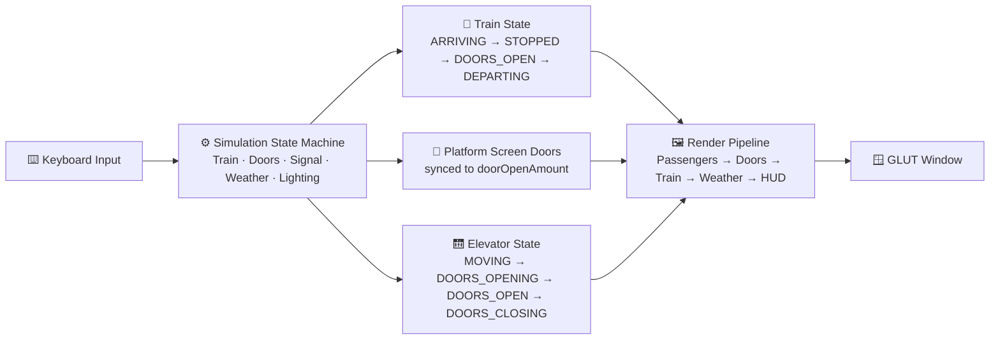

<div align="center">

# 🚇 Smart Metro Rail Station Simulation

### An Interactive 2D Computer Graphics Simulation of a Modern Metro Station

[](https://en.cppreference.com/w/cpp/17)
[](https://www.opengl.org/)
[]()
[]()
[]()

*A fully interactive metro station — trains, platform screen doors, an elevator, an escalator, weather, and a full day/night cycle — rendered entirely with fundamental 2D graphics algorithms and a keyboard-driven simulation loop.*

</div>

---

## 📑 Table of Contents

- [📖 Overview](#-overview)
- [🎯 Project Objectives](#-project-objectives)
- [🏗 System Architecture](#-system-architecture)
- [🛠 Tools Used](#-tools-used)
- [✨ Features](#-features)
- [🌗 Dynamic Lighting](#-dynamic-lighting)
- [🎮 Controls](#-controls)
- [🧰 Requirements](#-requirements)
- [🏗️ Building](#️-building)
- [▶️ Running](#️-running)
- [🗂️ Project Structure](#️-project-structure-single-file-layout)
- [📝 Notes](#-notes)
- [🎓 Academic Context](#-academic-context)

---

## 📖 Overview

The simulation renders a complete metro station scene: railway tracks, an elevated platform with safety doors, a ticket counter and gates, a waiting area, an elevator shaft, an escalator, station signage, a signal system, and a live HUD. A train can be dispatched, brought to a stop, and have its doors opened and closed — with the platform's own screen doors and the passenger crowd responding to that state in real time, all set against a full day/night lighting cycle and rain/fog weather effects.

---

## 🎯 Project Objectives

The primary goal of this project is to demonstrate **practical, hands-on application of core Computer Graphics concepts** through a single, cohesive real-world simulation — rather than isolated textbook exercises. Specifically, the project sets out to:

- 🏙️ **Model a realistic 2D metro station** — platform, tracks, infrastructure, and surroundings — as a unified scene
- 🚆 **Simulate authentic train behavior** — arrival, braking, stopping, door cycles, and departure
- 🚶 **Implement passenger movement** — queuing, boarding, and exiting in response to train state
- 📐 **Apply fundamental CG algorithms directly** — DDA, Bresenham, and Midpoint Circle, implemented by hand rather than relying on built-in primitives
- 🔄 **Use 2D geometric transformations** — translation and scaling — to drive every moving part (doors, elevator, escalator, passengers)
- 🌗 **Design a full environmental system** — dynamic lighting, weather, and time-of-day transitions
- ⌨️ **Provide meaningful interactivity** — every major system is directly controllable via keyboard input
- 🎓 **Reinforce OpenGL/GLUT proficiency** — through a project large enough to require real state management, not just static rendering

---

## 🏗 System Architecture

The entire scene is a single fixed-tick simulation loop: every ~30ms, state is advanced (`timerFunc`) and the frame is repainted (`display`) in strict back-to-front layer order, so later draw calls visually occlude earlier ones.



| Layer | Implementation |
|---|---|
| 🖼️ **Rendering** | Legacy/immediate-mode OpenGL (`glBegin`/`glEnd`) via GLUT |
| ⚙️ **Simulation** | A tick-based state machine (`glutTimerFunc`) driving trains, doors, elevator, weather, and lighting |
| ⌨️ **Input** | GLUT keyboard callback mapping single keys to state transitions |
| 📐 **Graphics core** | Hand-implemented DDA, Bresenham, and Midpoint Circle algorithms, plus 2D transformations |

---

## 🛠 Tools Used

| Category | Technology | Purpose |
|---|---|---|
| 🧠 **Language** | C++ (17) | Core simulation logic and structured, function-driven design |
| 🖼️ **Graphics API** | OpenGL (immediate mode) | Rendering all shapes, colors, and transformations to screen |
| 🪟 **Windowing / Utility Toolkit** | GLUT / FreeGLUT | Window creation, keyboard input handling, and the animation timer loop |
| 🧩 **Alternative Windowing** | GLFW *(optional)* | Drop-in alternative window/context backend |
| 📐 **Graphics Algorithms** | DDA · Bresenham · Midpoint Circle | Hand-implemented rasterization, used instead of relying on built-in shape primitives |
| 🔄 **Transformations** | Custom 2D Translate / Scale | Drives every moving element — doors, elevator, escalator, passengers |
| 🛠️ **Build Tools** | `g++` / `clang++` / CMake | Compilation and cross-platform build configuration |
| 💻 **IDE** | CLion *(or any C++ IDE)* | Primary development environment used for the project |

---

## ✨ Features

Every system below is fully interactive and responds to live simulation state — nothing is a static backdrop. Here's what's actually running under the hood:

<table>
<tr>
<td width="50%" valign="top">

### 🚆 Train Operations
Full lifecycle simulation — a train arrives, brakes to a stop, opens its doors, and departs on command.
- Arrival → braking → stopping → departure
- Complete door open/close animation cycle
- 🛑 Emergency stop override at any point

</td>
<td width="50%" valign="top">

### 🚪 Platform Screen Doors *(Safety System)*
A real passenger-safety barrier, not just decoration — it physically gates access to the platform edge.
- Glass barrier doors along the safety line
- Unlock **only** when the train's own doors open
- Red/green status LEDs mirror real-world PSDs

</td>
</tr>
<tr>
<td width="50%" valign="top">

### 🚶 Passenger Simulation
A small animated crowd that actually reacts to the train, instead of walking in place regardless of state.
- Queuing, boarding, exiting, and idle waiting
- Simple animated crowd movement
- Boarding only occurs once doors are safely open

</td>
<td width="50%" valign="top">

### 🛗 Elevator & 🔼 Escalator
Vertical circulation modeled with the same care as the train itself.
- Lift car cycles between surface and platform
- Opens doors, dwells, then closes at each stop
- Continuously animated escalator step motion

</td>
</tr>
<tr>
<td width="50%" valign="top">

### 🌗 Dynamic Lighting
A full day-to-night atmosphere, not a fixed background — see the [dedicated section](#-dynamic-lighting) below for details.
- Day / Evening / Night modes, smoothly blended
- Animated sun/moon and station lamp glow

</td>
<td width="50%" valign="top">

### 🌧️ Weather Effects
Layered on top of any lighting mode for a huge range of atmosphere combinations.
- Toggleable light rain, heavy rain, and fog
- Wet-surface reflections

</td>
</tr>
<tr>
<td width="50%" valign="top">

### 🚦 Signal System
A working signal, not a static prop — it reflects the train's actual status at all times.
- Automatic or manual signal control
- Colour state tied directly to live train state

</td>
<td width="50%" valign="top">

### 🏢 Station Infrastructure
The surrounding station dressed out in full — the details that make it feel like a real place.
- Ticket counter, gates, benches, waiting shelter
- Signboards, digital and analog clocks

</td>
</tr>
</table>

**Also included:** 🖥️ a live HUD (announcements + on-screen diagnostics), 🎥 multiple cycling camera views, and the full set of 📐 **core Computer Graphics techniques** — DDA Line Algorithm, Bresenham Line Algorithm, Midpoint Circle Algorithm, 2D geometric transformations (translation, scaling), the RGB color model, and frame-by-frame animation.

---

## 🌗 Dynamic Lighting

The station's atmosphere shifts continuously rather than snapping between fixed looks — sun and moon position, sky gradient, and station lamp glow all blend smoothly as the lighting mode changes.

| Mode | Description |
|---|---|
| ☀️ **Day** | Bright daytime environment |
| 🌆 **Evening** | Transition lighting |
| 🌙 **Night** | Dark environment with station illumination |

> 💡 Press **`N`** to cycle Day → Evening → Night, or **`L`** for a quick Evening preview — see [Controls](#-controls) for the full key map.

---

## 🎮 Controls

| Key | Action |
|---|---|
| `A` | 🚆 Train arrives |
| `D` | 🚀 Train departs |
| `S` | 🛑 Emergency stop |
| `G` | 🚦 Change signal (manual mode) |
| `O` | 🔓 Open doors |
| `C` | 🔒 Close doors |
| `P` | ⏯️ Pause / resume simulation |
| `L` | 🌆 Evening preview |
| `N` | 🌗 Cycle Day → Evening → Night |
| `M` | 🤖 Toggle Auto / Manual signal mode |
| `F` | 🌫️ Toggle fog |
| `R` | 🌦️ Toggle light rain |
| `T` | ⛈️ Toggle heavy rain |
| `V` | 🎥 Cycle camera view |
| `Esc` | 🚪 Exit |

> 💡 The full control list is also shown in-app via the bottom-left controls panel.

---

## 🧰 Requirements

- A C++17-capable compiler (`g++` or `clang++`)
- OpenGL
- GLUT (or FreeGLUT)
- GLFW *(optional — the project also compiles against system GLUT alone)*

<table>
<tr>
<td valign="top">

**🍎 macOS**
```bash
brew install glfw glew
```
*(OpenGL and GLUT are provided by system frameworks)*

</td>
<td valign="top">

**🐧 Linux (Debian/Ubuntu)**
```bash
sudo apt install freeglut3-dev \
    libglfw3-dev libglew-dev
```

</td>
<td valign="top">

**🪟 Windows**
```powershell
vcpkg install freeglut glfw3 glew
```
*(or MSYS2/MinGW-w64 — see below)*

</td>
</tr>
</table>

---

## 🏗️ Building

### Option A — Direct Compile

<table>
<tr><td>

**macOS**
```bash
clang++ -std=c++17 Metro.cpp -o Metro \
    -framework OpenGL -framework GLUT -framework Cocoa \
    -I/opt/homebrew/include -L/opt/homebrew/lib -lglfw -lGLEW
```

</td></tr>
<tr><td>

**Linux**
```bash
g++ -std=c++17 Metro.cpp -o Metro \
    -lGL -lGLU -lglut -lglfw -lGLEW
```

</td></tr>
<tr><td>

**Windows** *(MSYS2/MinGW-w64 terminal)*
```bash
g++ -std=c++17 Metro.cpp -o Metro.exe \
    -lfreeglut -lopengl32 -lglu32 -lglfw3 -lglew32
```

</td></tr>
</table>

### Option B — CMake

If you're using CLion, Visual Studio, or prefer CMake on any platform, create a `CMakeLists.txt` alongside `Metro.cpp`:

```cmake
cmake_minimum_required(VERSION 3.16)
project(Metro)

set(CMAKE_CXX_STANDARD 17)
set(CMAKE_CXX_STANDARD_REQUIRED ON)

find_package(OpenGL REQUIRED)
find_package(GLUT REQUIRED)

add_executable(Metro Metro.cpp)
target_link_libraries(Metro OpenGL::GL GLUT::GLUT)
```

Then build:
```bash
mkdir build && cd build
cmake ..
cmake --build .
```

> 🪟 **Windows + Visual Studio note:** if you installed dependencies via **vcpkg**, pass its toolchain file when configuring so `find_package` can locate GLUT/GLFW:
> ```powershell
> cmake .. -DCMAKE_TOOLCHAIN_FILE=[path-to-vcpkg]/scripts/buildsystems/vcpkg.cmake
> cmake --build .
> ```
> This produces `Metro.exe`, which can also be opened and run directly from within Visual Studio or CLion.

---

## ▶️ Running

<table>
<tr>
<td valign="top">

**macOS / Linux**
```bash
./Metro
```

</td>
<td valign="top">

**Windows**
```powershell
Metro.exe
```

</td>
</tr>
</table>

A window titled **"Smart Metro Rail Station Simulation | CG Lab Project"** will open. Use the keyboard controls above to interact with the station. 🎉

---

## 🗂️ Project Structure (single-file layout)

`Metro.cpp` is organized into clearly labeled sections:

| # | Section | # | Section |
|---|---|---|---|
| 1 | 🔧 Global Constants | 11 | 🏢 Metro Infrastructure |
| 2 | 🏷️ Enumerations | 12 | 🚆 Metro Train |
| 3 | 🧱 Data Structures | 13 | 🚶 Human Elements |
| 4 | 🌐 Global Simulation State | 14 | 🌧️ Weather Effects |
| 5 | 📋 Function Prototypes | 15 | 🖥️ Heads-Up Display |
| 6 | 📐 Core Graphics Algorithms | 16 | ⚙️ Simulation State Machine |
| 7 | 🔄 2D Geometric Transformations | 17 | 🎥 Camera / Projection |
| 8 | 💡 Lighting Palette System | 18 | ⌨️ Keyboard Input Handling |
| 9 | 🌳 Environment | 19 | 🔁 GLUT Callbacks |
| 10 | 🐦 Optional Enhancements *(Birds, Wind, Multi-Station)* | 20 | 🚀 Program Entry Point |

---

## 📝 Notes

- ⚠️ Legacy OpenGL (`glBegin`/`glEnd`, immediate mode) is used throughout for simplicity and GLUT compatibility — this produces deprecation warnings on macOS but does not affect functionality.
- ⏱️ All animation (train, doors, elevator, escalator, weather, lighting transitions) is advanced on a fixed simulation tick via `glutTimerFunc`.

---

## 🎓 Academic Context

<div align="center">

This project was developed as a **Computer Graphics (CG) Lab** course project, demonstrating the practical application of 2D rendering algorithms, geometric transformations, and interactive animation in a real-world-inspired transportation simulation.

*Built with 🚆 for learning, and 🖥️ in pure OpenGL.*

</div>
## 👤 Author

**Taufique Hassan**

> 🚆 Designed with algorithms.  
> 🎨 Brought to life with graphics.  
> 💻 Built with C++ & OpenGL.
